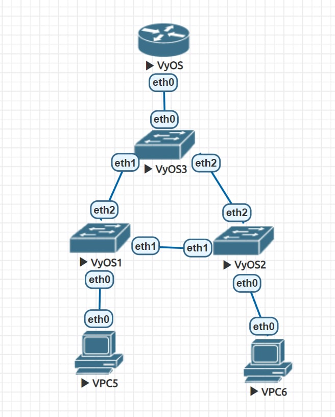
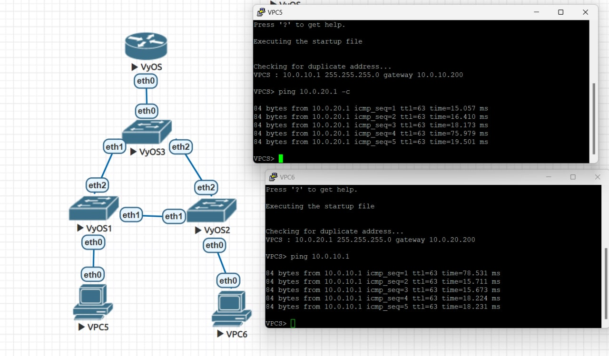
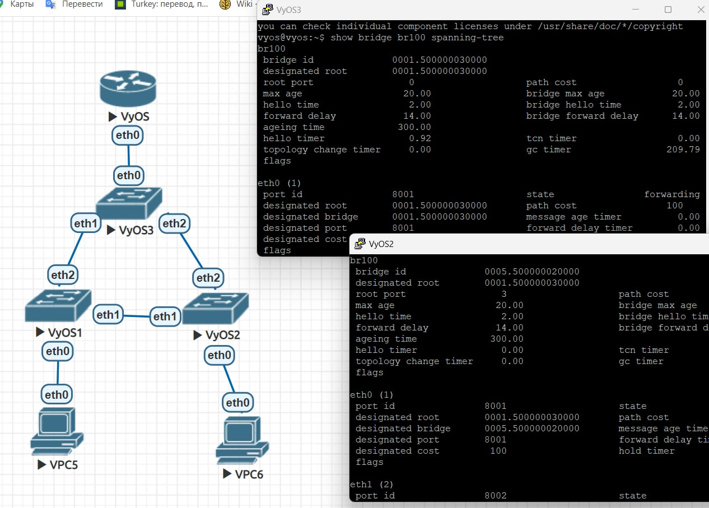
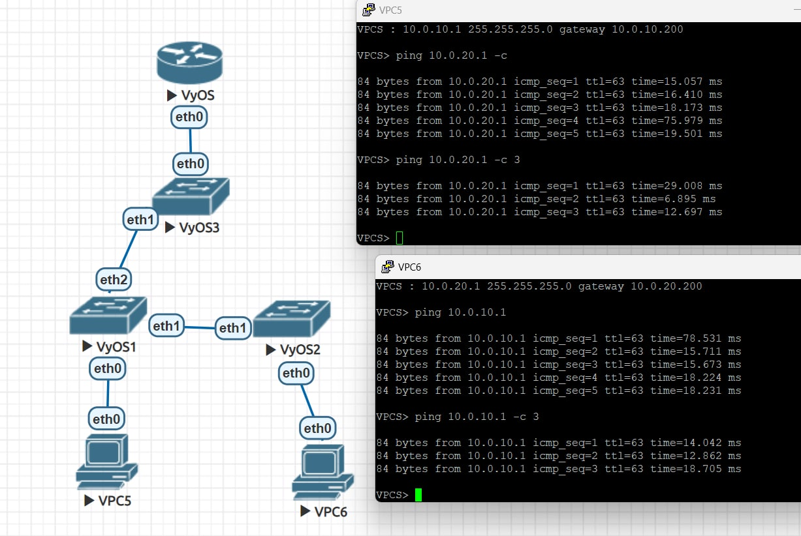

# Сохраненные конфигурации

[vpc5](vpc5): 10.0.10.1 vlan 10
[vpc6](vpc6) : 10.0.20.1 vlan 20

[vyos1](vyos1), [vyos2](vyos2) - комутаторы уровня доступа

[vyos3](vyos3) - комутатор уровня распеределния

[vyos](vyos) - маршрутизатор

# Сеть

# Пользователи могу общаться друг с другом

# vyos3 выбран корнем

# Связность не нарушается

