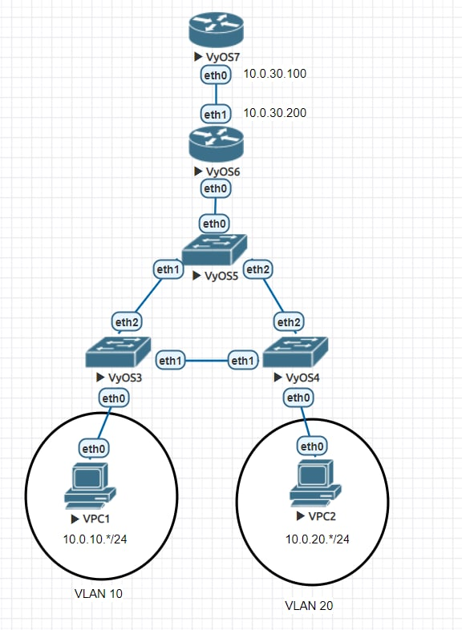
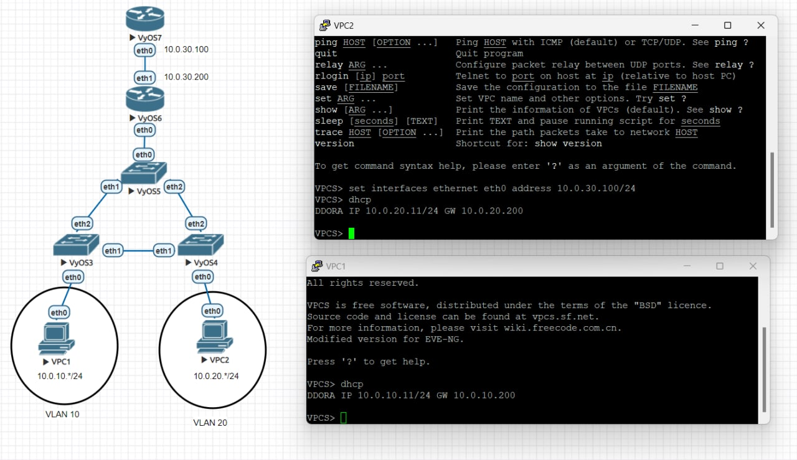
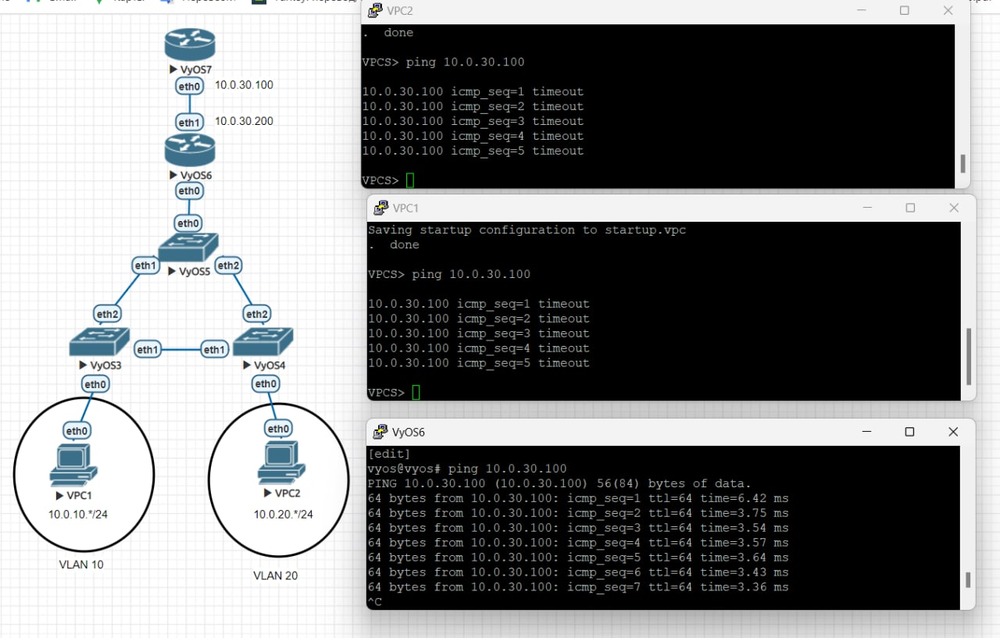
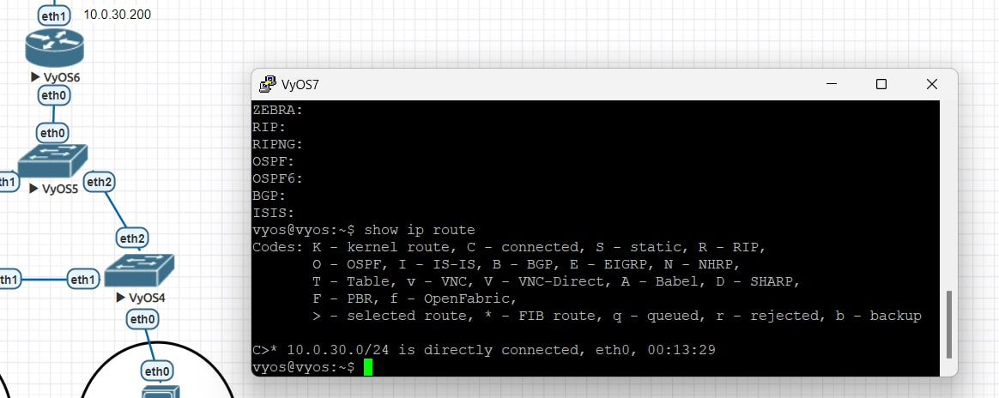
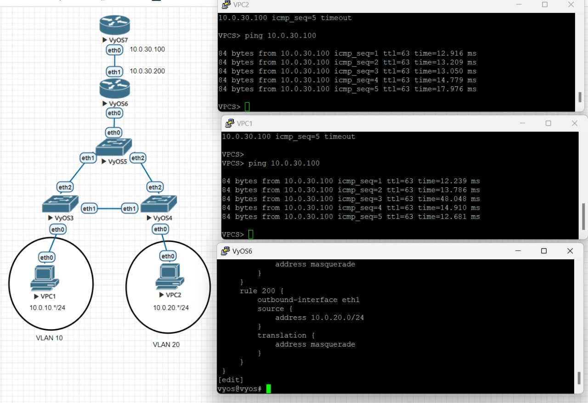
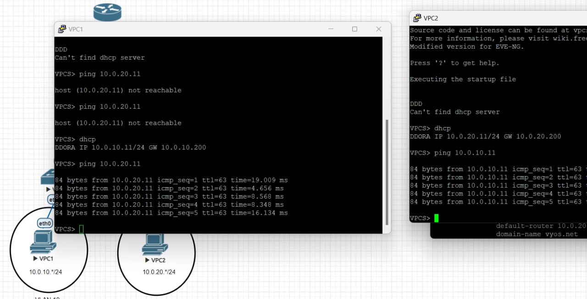

# Сохраненные конфигурации

[vpc1](vpc1): 10.0.10.* vlan 10

[vpc2](vpc2) : 10.0.20.* vlan 20

[vyos3](vyos3), [vyos4](vyos4) - комутаторы уровня доступа

[vyos5](vyos5) - комутатор уровня распеределния

[vyos6](vyos6) - маршрутизатор сетей клиентов

[vyos7](vyos7) - внешний маршрутизатор

# Сеть

# Пользователи получают свои ip через dhcp

Здесь видно все, кроме dns, видимо его проверить только в файлике с конфигурацией. Причем адреса не `10.0.*.1`, а `10.0.*.11`

# Без nat нет доступа к vyos7

Клиенты на vpc не могут допинговаться, а vyos6, соединенный напрямую - может

Здесь скорее не могу достучаться, потому что vyos7 не знает про сети 10.0.10.0 и 10.0.20.0. Я ставила firewall на vyos6.eth1, но кажется firewall срабатывает раньше чем ip подменяется. А чтобы ставить firewall на vyos7, он видимо должен как-то узнать про эти сети, чего мы не хотим. Он соединен напрямую только с 10.0.30.0/24

# Nat дает доступ
Здесь добавляю в конфигурацию команды `set nat ...` и снова проверяю доступ

# Клиенты видят друг друга

Единственно - клиенты стартуют обычно быстрее vyos, поэтому если стартовать всех одновременно, dhcp-server может сначала не найтись