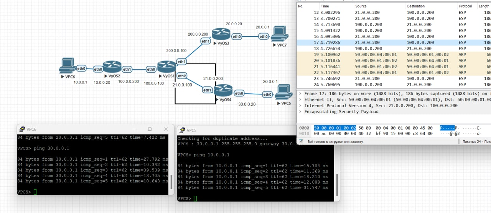

# Сохраненные конфигурации

[vpc6](vpc6): 10.0.0.1

[vpc7](vpc7): 20.0.0.1

[vpc5](vpc5): 30.0.0.1

[vyos1](vyos1) - интернет

[vyos2](vyos2) - общий роутер для обоих тунелей

[vyos3](vyos3) - только gre

[vyos4](vyos4) - gre + ipsec

# Сеть

# default route на пограничных настроен в интернет

# В интернете только direct connected

# GRE работает

# GRE + IPSec работает

